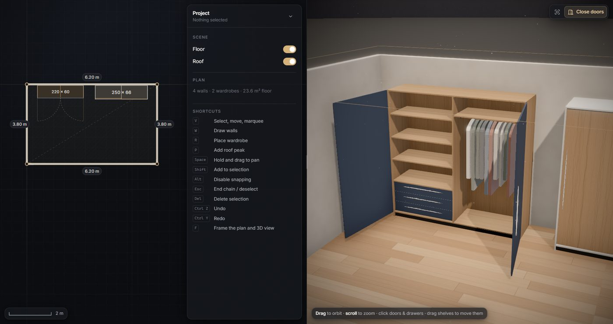
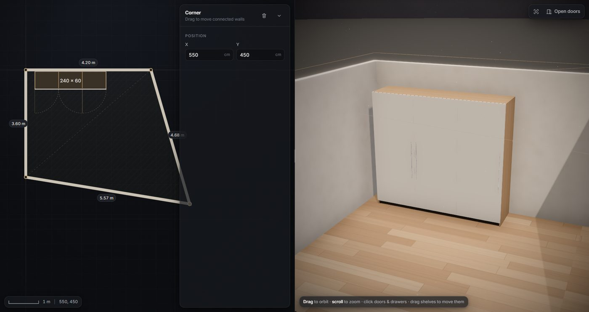
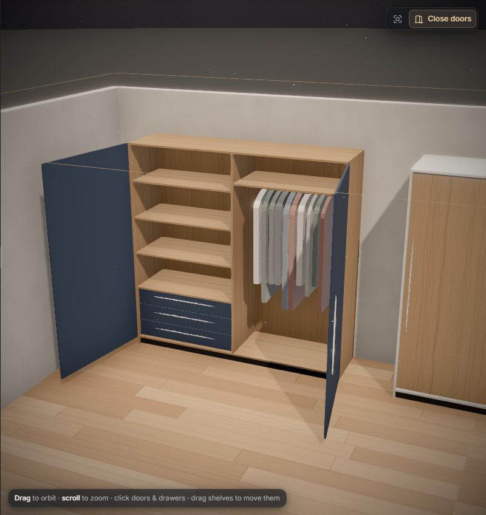
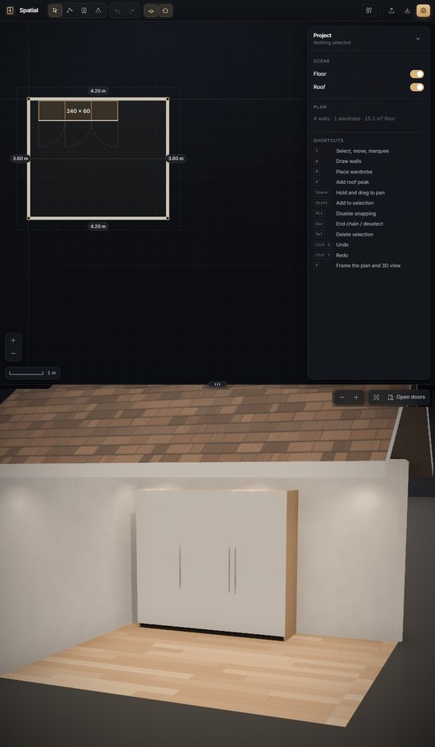

# 🏛️ Spatial Morph: Real-Time 2D/3D Architectural Configurator

**A commercial-grade parametric interior configurator built for luxury furniture brands, prop-tech, and spatial commerce.**

 

---

## ⚡ Executive Summary

Off-the-shelf room plan editors are clunky, and standard 3D web configurators struggle with real-time parametric feedback.

**Spatial Morph** solves this by coupling a sub-pixel 2D vector (SVG) CAD canvas to an unconstrained, photorealistic WebGL 3D rendering pipeline. Every single edit—whether drawing arbitrary room geometry, adjusting wall slopes, or dragging wardrobe components—propagates through a high-performance reactive state engine directly into the GPU pipeline in under **16 milliseconds (60 FPS)**.

> **Note on this deployment:** This repository hosts an interactive technical demonstration compiled for web preview. The underlying architectural source code, custom geometry engines, and algorithmic layouts are proprietary intellectual property. **Available for bespoke enterprise licensing, integration, or contract development.**

---

## 🖥️ Interactive Showcase Preview

  <table>
    <tr>
      <td width="50%">
        
        
<b>Real-Time 2D Vector CAD Canvas</b> <i>Continuous snapping, mitre math, and dynamic guides</i>

      </td>
      <td width="50%">
        
        
<b>Physically Based Real-Time 3D View</b> <i>PBR materials, soft shadows & dollhouse cutaways</i>

      </td>
    </tr>
  </table>

---

## 📱 Mobile, Tablet & Portrait Monitor Support

<table>
  <tr>
    <td width="40%">
      
    </td>
    <td>
      
The layout adapts to any screen, so you can plan a room on a phone, a tablet or a rotated monitor:

      <ul>
        <li><b>Landscape desktops:</b> plan and 3D side by side with a draggable splitter.</li>
        <li><b>Portrait monitors & tablets:</b> plan on top, 3D below; drag the grip to resize.</li>
        <li><b>Phones:</b> full-screen Plan / 3D tabs, a bottom-sheet properties panel and touch-friendly controls.</li>
      </ul>
    </td>
  </tr>
</table>

---

## 📐 Core Engineering Highlights

### 1. Zero-Latency Bi-Directional Synchronization

- **Reactive Pipeline:** Built on an atomic **Zustand** store with optimized selective subscriptions. Dragging nodes in the 2D plane dispatches changes directly to GPU buffer attributes without triggering full scene graph unmounts.
- **Granular Diffing:** Only modified geometry (a solitary wall prism or a single drawer slider) is updated per frame; instanced components (hardware, handles, shelving) reuse memory buffers and GPU primitives.

### 2. Parametric CAD & Pure Geometry Engine

- **Dynamic Wall Mitring:** Arbitrary graph-based node/edge layout with exact trigonometric mitring at shared room corners, maintaining precise wall thickness across variable junction angles.
- **12 Parametric Roof Styles:** Gable, hip, shed, flat, pyramid, cross gable, gambrel, mansard, half-hip, butterfly, sawtooth and asymmetric roofs are generated from the plan. Rectilinear rooms are split into wings that meet in true valleys (cross-gables, cross-hips), and one pitch control re-shapes any style live.
- **Automated Spatial Packaging:** An integrated bin-packing layout algorithm (`layout.ts`) automatically balances internal compartments, hang rails, drawer stacks, and shelf distributions based on door configurations.

### 3. Studio-Grade Procedural Photorealism

- **100% Asset-Free Shading:** No heavy GLTF or external megabyte-scale texture downloads. Warm European oak, brushed metals, matte architectural lacquers, and plaster walls are synthesized purely via procedural shaders for instantaneous page loads.
- **Cinematic Viewport:** AgX filmic tone-mapping, Screen-Space Ambient Occlusion (N8AO), dynamic soft shadows, depth cueing, and an intelligent dollhouse camera that automatically hides obstructing walls between the eye and the focal target.

---

## 🛠️ Architecture & Technology Stack

| Layer            | Technology                         | Key Responsibility                                                           |
| :--------------- | :--------------------------------- | :--------------------------------------------------------------------------- |
| **UI Shell**     | React (Latest) + Vite + CSS        | Glassmorphic floating panels, resizable panes, responsive docking            |
| **2D Engine**    | SVG / Vector Graph Engine          | Interactive node graph, angle snapping (0°/45°/90°), live dimensional labels |
| **3D Engine**    | `@react-three/fiber` + `three.js`  | WebGL scene composition, custom mesh extrusion, instanced meshes             |
| **Shaders & FX** | `@react-three/postprocessing`      | Real-time AO, bloom, procedural material generators                          |
| **State & Math** | Zustand + Zundo + polygon-clipping | Single-source-of-truth state tree, deep undo/redo, roof plane clipping       |
| **Validation**   | Zod                                | Strict schema validation for imported/exported spatial manifests             |

---

## 🎮 Key Features in the Demo

- [x] **Split-Screen Dynamic Viewport:** Drag the central splitter or flip between stacked tabs on smaller viewports.
- [x] **Vector Plan Tooling:** Add nodes, close wall loops, modify individual wall thicknesses, and dial in asymmetric ceiling heights.
- [x] **Interactive Wardrobe Configurator:** Snap wardrobe backboards flush against walls; adjust doors, drawers, and modular shelves in real time.
- [x] **Interactive 3D Elements:** Click hinged doors to swing open (100° clearance), slide drawers along their tracks, or inspect interior lighting.
- [x] **State Snapshotting:** Complete persistent state preservation via local storage and sub-tree undo/redo operations (`Ctrl+Z` / `Ctrl+Y`).
- [x] **Export Capabilities:** One-click JSON state manifest export and high-resolution WebGL canvas snapshotting.

---

## 💼 Hire & Custom Development

Looking to build a custom 3D configurator, a complex CAD editor, or high-performance WebGL solutions for your product?

I specialize in bridging the gap between **complex spatial mathematics** and **silky-smooth web interfaces**.

### Services Available:

- **Custom 3D Product Configurator Development** (Web, Mobile, Enterprise)
- **High-Performance 2D Vector / CAD Tooling** (Canvas, WebGL, SVG)
- **Performance Audits & WebGL Optimization** (Frame rate stabilization, memory leak profiling)
- **End-to-End Frontend Architecture** for PropTech, eCommerce, and Creative Tools

### 📬 Get in Touch:

- **Portfolio / Website:** [ashhadahmd.com](https://ashhadahmd.com)
- **LinkedIn:** [linkedin.com/in/ashhad-ahmed](https://linkedin.com/in/ashhad-ahmed)
- **Email:** [ashhad.ahmed776@gmail.com](mailto:ashhad.ahmed776@gmail.com)

---

  © 2026 Crafted with precision. All rights reserved. Commercial replication of this engine without explicit authorization is strictly prohibited.

